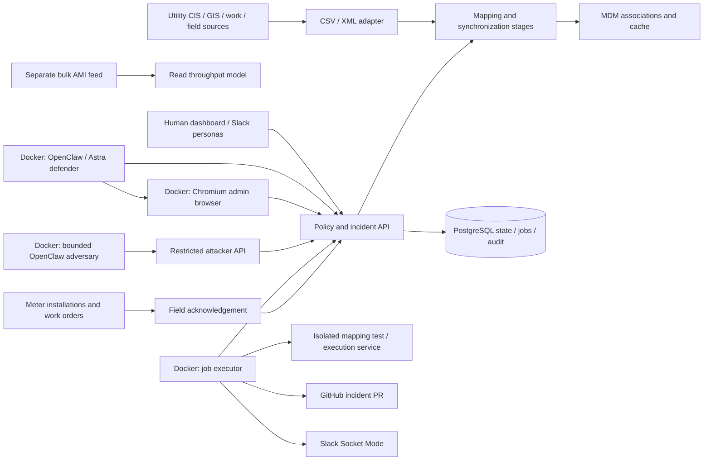

# Architecture and demo contract

The default demo mission is to contain exposed contractor access while unaffected service points and bulk AMI intake continue. The advanced mission restores trustworthy meter operations after a mapping incident. Utility behavior and authority are deterministic. OpenClaw chooses investigations and response plans dynamically through a bounded capability interface.

## Runtime split

Local Compose hosts PostgreSQL, Next.js, the executor, code lab, and two OpenClaw gateways. The hosted topology puts Next.js on Vercel and state in Neon; the executor, code lab, Chromium, and OpenClaw stay on this machine. Vercel handles bounded requests, never an agent or worker loop.

OpenClaw is pinned to the official 2026.9.3 browser image by digest. The configured model is `openai/gpt-6-astra`, using the Responses provider and explicitly selecting `agentRuntime.id: openclaw`. Defender and attacker have separate persistent state/workspaces. No runtime mounts this development checkout or the Docker socket.

The driver resumes one conversation per role/run when relevant evidence, access state, plans, or human input changes. Default limits are 40 defender turns, 12 attacker turns, and 12 accepted-or-denied authorized attack attempts per run. Heartbeats, scheduled automation, shell/file tools, and subagent spawning are disabled. The defender browser is limited to the configured utility hostname; the attacker has no browser tool. Tool authorization is enforced again by the API.

The defender tool adapter projects the authorized API state into a bounded current view below OpenClaw's tool-output limit. It preserves current authority, checks, scope and recent human messages; older evidence and artifact source can be retrieved by ID. The full dashboard/persistence view remains intact. Defender wake conditions track threat, human input, scope, access, worker, plan and field-state changes rather than repeated throughput observations.

Slack Socket Mode belongs to the executor. Authenticated Slack user IDs become human actors in the backend, independently of the model. The defender sees their statements and approval changes on its next turn. A claim inside a message never changes a role or approval policy.

Recording instrumentation is an observation channel outside utility authority. The driver uses an explicit stable OpenClaw session per role/run; plugin tool hooks match that session and write sanitized call metadata to the role's existing private state volume. A host-only terminal collector combines those records with existing API receipts and published plan rationales. It neither returns combined telemetry to the agents nor alters their tool permissions. Browser tickets, snapshots, raw tool results, provider reasoning fields, and credentials are excluded from recording output. A recording receipt is never a recovery receipt.

## Utility fidelity

The interview's integration shape remains: utility sources own customer/service-point/asset/work information; CSV or `SDPSyncMessage/Payload/Record` XML enters a normalized pipeline; source mapping, path resolution, SOR filtering, value mapping, premerge, merge, derivation, postmerge, cache invalidation, save, and status/exception stages are retained in transaction evidence. Effective dates, meter MRIDs, outgoing meter end dates, and source provenance drive relationship behavior. Bulk AMI reads are separate.

The fixture has 20 service points, 23 meters, three exchanges, a primary worker, an independent reserve, four synthetic people, credentials, code artifacts, a cache, and work orders. The source and physical installation advance before the pending integration transactions. The compromised mapper both fails to end-date the outgoing meter and sends replacements to the wrong service point.

Simplifications are explicit: one utility segment and active incident; collapsed CIS/GIS/WMS source snapshots; stage names with a compact mapper rather than actual enterprise products; counter-based AMI batches; digital field records acknowledged by an operations persona rather than hardware sensing; a trusted seed artifact rather than an initial real deployment; and consecutive SDP groups validated together on input admission, with admitted rows executed as individual normalized transactions. This is not a complete FlexSync implementation or a claim about a real utility vulnerability.

## State, effects, and trust

PostgreSQL stores a versioned run snapshot plus relational object, relationship, approval, and append-only audit projections. A transaction-scoped advisory lock serializes mutation and first-run initialization. Expected run IDs reject work after reset, revision guards reject stale worker mappings, and idempotency keys prevent duplicate effects. File storage exists only for single-process development and is refused on Vercel.

Rehearsal runs on a clone of the current state and cannot invent field acknowledgements or live test receipts. Execution requires current role approvals, matching threat version, unexpired authorization, and action prerequisites. A new adversary action invalidates pending authority. Every applied step records an action receipt; jobs use leases and retain their completed step index across restarts. Ambiguous external delivery is marked indeterminate and requires reconciliation.

Model-produced mapping code is tested in a separate container with an internal-only Docker network, no credentials, no capabilities, a read-only filesystem, process/memory limits, and a short-lived Node child. Node `vm` adds a guard but is not the isolation boundary. The executor verifies source digests, retains test receipts, creates an isolated GitHub PR in live mode, and then promotes the validated artifact under platform approval.

Evaluator ground truth is not returned to either agent. Defender observations include operational source evidence and confirmed field reports; attacker observations contain only the synthetic contractor-accessible surface. Final mission checks independently compare source relationships, cache, field acknowledgement, worker provenance, denied credential probes, queue disposition, and continued healthy processing.

## Evidence labels

`simulation` runs allow manual candidates and local tested patches; `live` runs enable model drivers and require a GitHub PR for corrective patch execution plus Slack for delivery; `replay` is deterministic evidence playback/evaluation. A plan's `VERIFIED` status means its individual requested steps completed and checks were recomputed. Only run status `verified` means **all mission checks passed and security-approved closure executed**. A containment plan can complete while the mission remains unresolved.

Primary runtime references: [OpenClaw Docker](https://docs.openclaw.ai/install/docker), [plugin tools](https://docs.openclaw.ai/plugins/building-plugins), [browser configuration](https://docs.openclaw.ai/tools/browser/configuration), and [heartbeat controls](https://docs.openclaw.ai/gateway/heartbeat).

## Simple containment mission

`credential-leak` is the default presenter scenario. The same utility integration structure remains, with aligned initial meter records, one planned exchange, and one bounded agent-initiated misuse of exposed contractor access. A trusted leak detector identifies both contractor grants; an ingress check rejects the suspect data update before an association write, while the work-order audit identifies the affected digital dispatch. The attacker cannot deploy code, pivot, or exceed one attempt on this surface. This models a small containment exercise, not a complete recovery incident.

The public mission objective is visible to the defender; evaluator scenario identifiers and physical truth remain hidden. `disable_principal` requires security and platform approval and independently evidenced exposed access for that principal. It revokes every existing grant for that principal and probes denial. Quarantine requires operations approval in this mission and holds both the rejected data record and affected field work. The executor refuses advanced repair/browser actions in this mission; advanced recovery retains its existing policies. Closure requires all three current approvals and the containment verifier. The code/data/cache/operator/continuity checks stay intact; physical and queue checks require a retained scoped hold instead of field confirmation and resumption.

A successful rehearsal creates version-bound, role-specific Slack review notifications automatically. The worker renders exact stored plan steps, explains each employee's decision and replies with recorded approval status. Identity, channel, incident thread, plan version, threat version and expiration remain server checked. Backticks around an otherwise exact command are accepted; prose never grants authority. Approval records now optionally retain their authenticated channel, and notifications optionally retain their review reference; both are additive JSON snapshot fields and need no relational migration. Legacy snapshots and recovery recording manifests remain readable.

Containment recording/export gates require all three current Slack approvals, delivered requests, independently checked code integrity and the retained affected scope. They do not require a PR or claim code repair. Exports explicitly label the containment objective. The three participants use Slack; the presentation view observes results and the presenter retains stop control.
