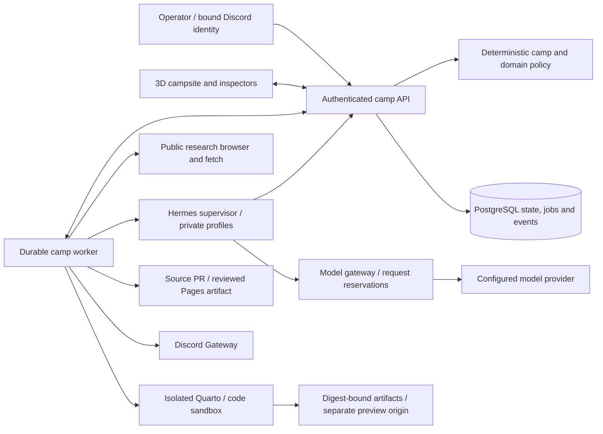

# Computer maneuver camps

Yamnaya's default experience is a world of mission-oriented camps. The same cycle applies across purposes: observe, contextualize, propose, rehearse, authorize, maneuver, verify. A camp combines a mission, agent configurations, resources, tool grants, evidence, publications and an append-only event history. The black cube represents the operator's authority; it is not itself an autonomous agent.

## Ownership and boundaries

- `packages/core/src/camps.ts`: schemas and deterministic transitions, camp authority, expiring grants, publication revisions, job eligibility, daily budgets, training candidates, lineage and legal games. No effects or model calls.
- `apps/web`: signed operator sessions and camp/job-scoped agent identities; bounded JSON requests; PostgreSQL transactions, revisions, idempotency and audit projections; 3D view and review controls. Browser/model approval claims have no authority.
- `services/worker/camps.ts`: scheduler, connector effects, runtime supervision and independently checked results. Web requests queue work rather than waiting for models, renders or deployments.
- `services/hermes`: pinned upstream runtime, a private supervisor, one child process per invocation, persistent per-camp/per-agent home and versioned conversation checkpoints. Only explicit cube tools and private memory are exposed. No built-in shell, filesystem editing, unbounded delegation or direct provider credentials.
- `services/sandbox` and `services/browser`: constrained execution and public research. Publication/code execution has a read-only container filesystem, temporary workspace, no external network and no credentials. Its process namespace is recycled after each job. The browser exposes only mediated public GET requests. Neither mounts the development checkout.

## State and execution

Camp mutations clone state, apply deterministic transitions and commit under a per-camp PostgreSQL advisory/row lock. State and event rows commit together. Idempotency keys return the original result. File storage is an explicit single-process development option with serialized atomic writes; it is not a hosted fallback.

Claims reserve daily reasoning budgets atomically across camps, permit two reasoning turns globally and one writer per agent, and issue a six-minute lease. External tool jobs can run while their parent Hermes turn awaits a result. Capability scope, grant expiry, camp status and configuration are checked at request, claim and execution. Publication operations also bind a source version and approved artifact digest. The model gateway reserves a bounded request allowance in camp state before provider access and records reported token usage when available.

A paused camp cancels queued work; its active agent tokens can no longer mutate state or reserve model calls. The worker cancels the corresponding Hermes invocation on its next check. Expired leases become indeterminate and are not automatically replayed. Already delivered remote effects require reconciliation, not an invented failure/success receipt.

The campsite animation projects persisted agent activities. Analysts approach the cube during external tool jobs, and social turns occupy the table area. It is a visualization of runtime activity, not evidence that work succeeded. Simulation turns, mechanical verification, and operator mission acceptance remain distinct.

## Google website image workflow

Agents can prepare image briefs for operator generation in Gemini or AI Studio. The operator imports outputs into versioned Quarto sources; import invalidates render approval. Yamnaya does not use a Google API or make purchases. See [Google tools](google-tools.md).

## Quarto publication contract

Production Vercel API requests and signed previews relay through a secret-authenticated Cloudflare tunnel to the local executor. PostgreSQL and immutable content-addressed objects stay on the host. The preview hostname remains separate from the console. The database-backed artifact adapter remains available for other deployments; every adapter verifies bytes against the digest.

A publication binds a repository, default branch, project directory, source files and monotonically increasing revision. The worker sends a source snapshot to the Quarto sandbox. Source references, bibliography keys, source digest and the rendered homepage are checked; the complete rendered artifact receives a digest. These mechanical checks do not prove factual accuracy.

The operator reviews the preview and approves that exact digest. Source edits and rollbacks create a new revision; rendering different bytes invalidates old approval. GitHub receives a source PR with the managed publication workflow. Before publication the worker verifies source bytes at the recorded PR head, merges that head under GitHub's protections, writes the reviewed output to an artifact branch, verifies its Git tree/blob hashes and dispatches Pages. Publication code is never re-executed in the credential-bearing deployment worker. Completion requires the expected public release marker; delayed or uncertain delivery remains indeterminate.

Reports should be concise, retain citations, distinguish evidence from inference, and use graphics or client-side interactivity only when useful. Quarto is the document and website system; GitHub provides version control and review. MCP remains a future connector boundary using these same grants, jobs and receipt verifiers.

See [camp operations](camps.md) for configuration and known limits, and [tasks](tasks.md) for the actual validation record.

## Cultural workflows and operations

`packages/core/src/cultural.ts` owns source dossiers, evidence-linked connections, four-role dependency tasks, exact-message approvals and comparative skill-promotion gates. `quota.ts` owns deterministic rate and monthly budget reservations. The worker stores these reservations under a database row lock before contacting Gemini. An active reservation serializes provider requests across camps. Expired or uncertain reservations are not refunded; quotas and budget waits release jobs until their persisted resume time.

Internal boards use an owner-scoped locked row, with private/shared visibility and bounded agent correspondence. Shared library entries point to released publications. Outbound delivery is claimed before the external effect; worker restarts do not blindly repeat uncertain messages. Cross-camp suppression uses hashed owner/destination records and is checked again before sending. Discord alerts and digests have durable unique delivery keys.

The local work projection and PostgreSQL notification wake the worker; periodic recovery still checks scheduled work. Read-only lease checks do not write camp revisions, and no-op transitions avoid state rewrites. See [cultural operations](cultural-camps.md) for budget semantics, manual evaluation limits and remaining credentials.
